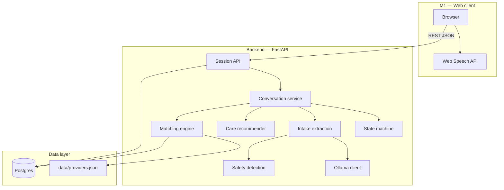

# Architecture

## Design principles

1. **Structured over free-form** — the state machine owns transitions; the LLM owns phrasing and extraction assistance.
2. **Local-first privacy** — user intake stays on-machine via Ollama; no hosted LLM APIs.
3. **Explainable matching** — deterministic scoring with human-readable strengths/concerns.
4. **One conversation engine** — M1 web and planned M2 telephony share backend logic.

## System context



## Repository layout

```text
florence/
├── backend/                 # FastAPI application
│   ├── app/
│   │   ├── agent/           # State machine, care recommender, prompts, safety
│   │   ├── api/             # REST routes (sessions)
│   │   ├── db/              # SQLAlchemy models, engine, init
│   │   ├── matching/        # Provider scoring engine
│   │   ├── models/          # Pydantic domain models
│   │   ├── security/        # Log redaction
│   │   └── services/        # Conversation, Ollama, extraction
│   └── tests/               # pytest suite (35 tests)
├── frontend/                # React + Vite + TypeScript
├── data/
│   └── providers.json       # 18 synthetic NYC-area providers
├── docs/                    # This documentation set
├── scripts/                 # test, lint, pre-push gate
└── docker-compose.yml       # Postgres 16
```

## Request flow (one message)


## Persistence

| Table | Purpose |
|-------|---------|
| `sessions` | Web conversation session, current state |
| `messages` | Turn-by-turn transcript |
| `intakes` | Structured JSON + completion % |
| `providers` | Seeded from `data/providers.json` |
| `care_recommendations` | Primary care type + rationale |
| `matches` | Top 1–3 provider results |
| `referrals` | Selected provider + mock status |

Tables are created on startup via `init_db()` (SQLAlchemy `create_all`). Alembic migrations are planned for production hardening.

## LLM responsibilities vs application responsibilities

| Concern | Owner |
|---------|-------|
| Which stage comes next | **State machine** |
| Required fields for qualification | **IntakeRecord.missing_required_fields()** |
| Natural language reply | **Ollama** (fallback: scripted prompts) |
| Field extraction | **Ollama JSON** + **rule-based fallback** |
| Provider ranking | **Matching engine** (deterministic) |
| Emergency escalation | **Safety phrase detector** |

## M2 telephony (planned)

Twilio + Pipecat will attach to the same `conversation` service. Browser voice in M1 already sends **text** to the same `/sessions/{id}/messages` endpoint; M2 swaps STT/TTS transport while reusing intake, matching, and referral logic.

See [roadmap.md](roadmap.md).
