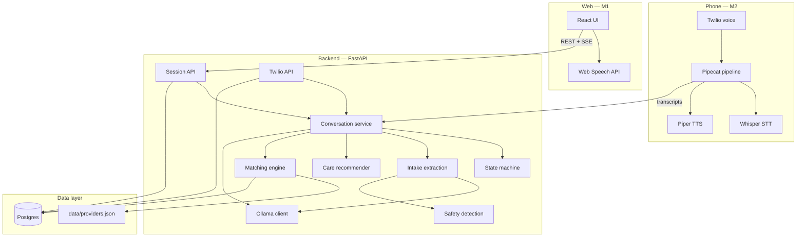
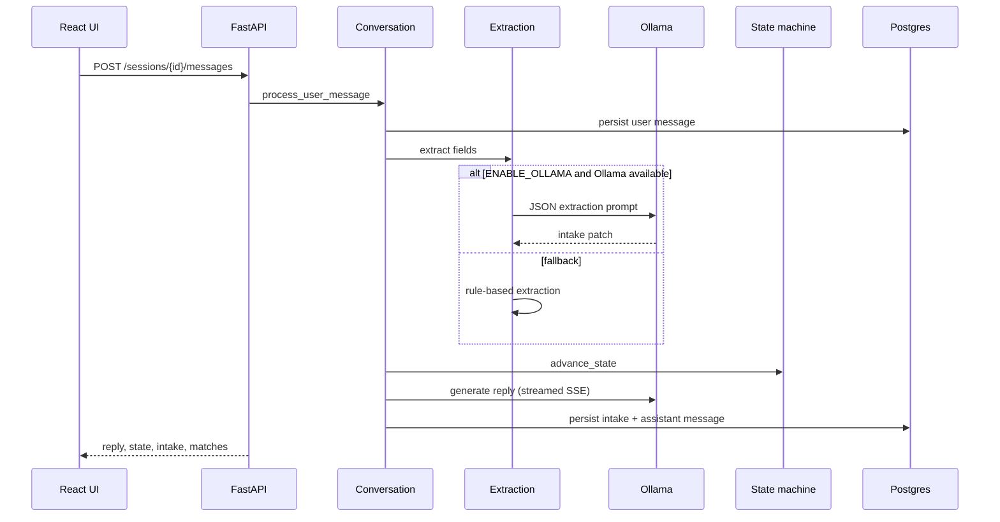
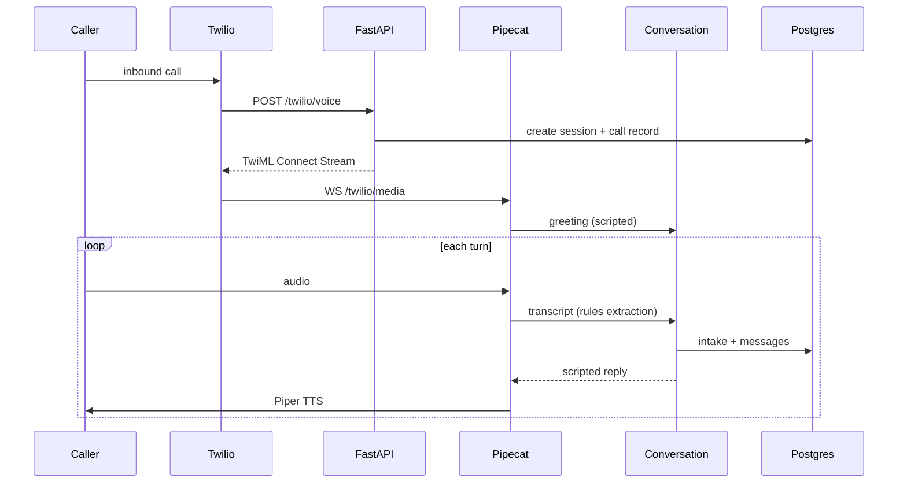

# Architecture

## Design principles

1. **Structured over free-form** — the state machine owns transitions; the LLM assists with phrasing and extraction on web.
2. **Local-first privacy** — user intake stays on-machine via Ollama; no hosted LLM APIs.
3. **Explainable matching** — deterministic scoring with human-readable strengths/concerns.
4. **One conversation engine** — web and phone share `services/conversation.py`; only transport differs.

## System context



## Web vs phone behavior

| Aspect | Web | Phone |
|--------|-----|-------|
| Transport | REST JSON + SSE stream | Twilio webhooks + WebSocket media |
| Replies | Ollama (with scripted fallback) | Scripted stage prompts by default |
| Extraction | Ollama JSON + rules | Rules only (lower latency) |
| Voice | Browser Web Speech API | Whisper STT + Piper TTS |
| Caller phone | Collected in contact stage | Pre-filled from Twilio `From` when available |

Phone defaults to scripted replies (`TELEPHONY_SCRIPTED_REPLIES=true`) because live Ollama calls added ~8s latency and echo-driven repeats. The same state machine and intake schema apply to both channels.

See [conversation-engine.md](conversation-engine.md) and [telephony.md](telephony.md).

## Repository layout

```text
florence/
├── backend/                 # FastAPI application
│   ├── app/
│   │   ├── agent/           # State machine, care recommender, prompts, safety
│   │   ├── api/             # REST routes (sessions, operator, twilio, demo)
│   │   ├── db/              # SQLAlchemy models, engine, Alembic helper
│   │   ├── matching/        # Provider scoring engine
│   │   ├── models/          # Pydantic domain models
│   │   ├── security/        # Log redaction
│   │   ├── services/        # Conversation, Ollama, extraction, Twilio
│   │   └── voice/           # Pipecat pipeline, Florence processor
│   └── tests/               # pytest suite (71 tests)
├── frontend/                # React + Vite + TypeScript
├── data/
│   └── providers.json       # 18 synthetic NYC-area providers
├── docs/                    # This documentation set
├── scripts/                 # test, lint, pre-push gate, telephony-dev
└── docker-compose.yml       # Postgres 16
```

## Request flow — web message



## Request flow — phone call



## Persistence

| Table | Purpose |
|-------|---------|
| `sessions` | Conversation session, current state |
| `messages` | Turn-by-turn transcript |
| `intakes` | Structured JSON + completion % |
| `providers` | Seeded from `data/providers.json` |
| `care_recommendations` | Primary care type + rationale |
| `matches` | Top 1–3 provider results |
| `referrals` | Selected provider + mock status |
| `call_records` | Twilio call SID, status, linked session |

Tables are created on startup via `init_db()` (SQLAlchemy `create_all`). Set `USE_ALEMBIC=true` to apply versioned migrations instead.

## LLM responsibilities vs application responsibilities

| Concern | Owner |
|---------|-------|
| Which stage comes next | **State machine** |
| Required fields for qualification | **IntakeRecord.missing_required_fields()** |
| Natural language reply (web) | **Ollama** (fallback: scripted prompts) |
| Natural language reply (phone) | **Scripted STATE_PROMPTS** (default) |
| Field extraction (web) | **Ollama JSON** + **rule-based fallback** |
| Field extraction (phone) | **Rules only** |
| Provider ranking | **Matching engine** (deterministic) |
| Emergency escalation | **Safety phrase detector** |

## Related docs

- [Conversation engine](conversation-engine.md)
- [Telephony setup](telephony.md)
- [API reference](api.md)
- [Roadmap](roadmap.md)
