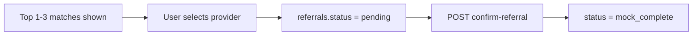

# Matching & Referrals

## Care-type recommender

Before provider matching, Florence suggests a **primary care type** with alternatives and plain-language rationale.

| Signal | Typical recommendation |
|--------|------------------------|
| Terminal / comfort-focused | Hospice |
| High medical complexity | Skilled nursing |
| Memory concerns + supervision | Memory care |
| ADL help, prefers home | Home care |
| Cannot live alone safely | Assisted living |

Implementation: `backend/app/agent/care_recommender.py`

**Important:** Recommendations are navigation guidance, not diagnosis. Disclaimers are embedded in conversation prompts.

## Provider matching engine

Two-stage deterministic matching in `backend/app/matching/engine.py`.

### Stage 1 — Hard filters

Exclude providers that fail essential requirements:

- Minimum price above caller's hard budget max
- Does not provide requested care type
- Outside geographic radius (ZIP-based approximation)
- Language preference not supported
- Stated deal-breakers

### Stage 2 — Weighted scoring (0–100)

| Category | Weight |
|----------|--------|
| Care capability fit | 35% |
| Budget fit | 20% |
| Location fit | 15% |
| Availability fit | 10% |
| Personal preferences | 10% |
| Quality signals | 5% |
| Referral viability | 5% |

Referral bounty **does not** override care suitability — it contributes only 5% after hard filters pass.

### Match explanations

Each result includes:

- `strengths` — caller-facing reasons (e.g. "Offers memory support")
- `concerns` — uncertainties (e.g. "Private room availability not verified")
- Internal `estimated_referral_value` — for operator view, not shown to callers in M1 UI

Returns top **3** matches by default.

## Provider seed data

18 synthetic providers in `data/providers.json` covering:

- Home care, assisted living, memory care, skilled nursing, hospice, respite
- NYC metro geography (Queens-heavy for demo scenario)
- Price, language, amenity, and capability variation

Loaded into Postgres on first session via `load_providers_from_seed()`.

## Referral flow (mock)

Requirements for confirmation:

- Provider previously selected
- `consent.consent_to_contact === true`

No live provider API calls — referral is logged in Postgres for demo purposes.

## Testing

- `tests/test_matching_engine.py` — Queens demo scenario, budget filter, explanations
- `tests/test_care_recommender.py` — hospice, home care, memory care rules
- `tests/test_provider_models.py` — seed file validity (≥15 providers, type variety)

## Future work

- Live provider inventory feeds
- Distance calculation via geocoding (currently ZIP-prefix heuristic)
- Separate caller-facing vs operator-facing match views
- Referral attribution and CRM handoff

See [roadmap.md](roadmap.md).
