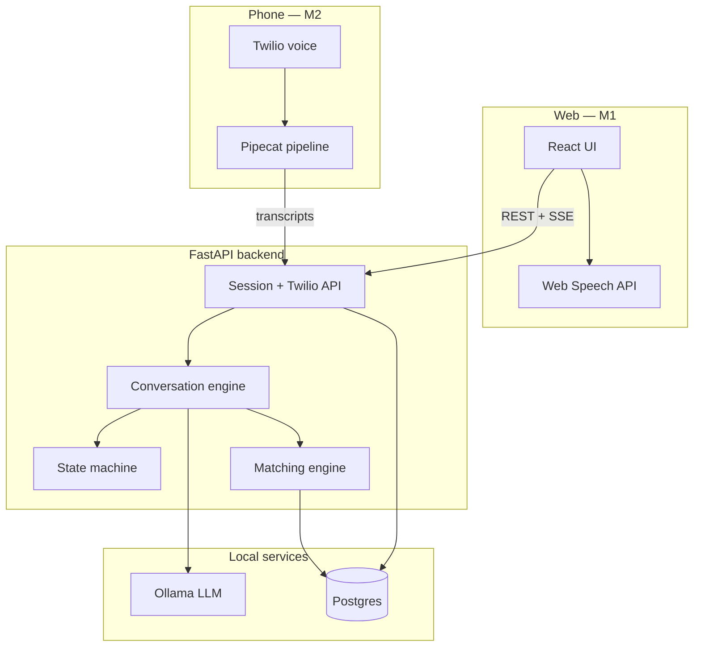

# Portfolio Overview — Florence

## Elevator pitch

**Florence** turns a confusing, emotional first contact about elder care into a structured intake, a care-type recommendation, ranked provider matches, and a clear next step — with **local-only AI** so sensitive family conversations never leave the machine.

Built for the **Arya Health hackathon** (Jul 2026).

## Problem

Families searching for elder care often:

- Don't know whether hospice, home care, assisted living, or skilled nursing fits
- Feel overwhelmed during an already stressful moment
- Repeat the same story to multiple providers without structure
- Need guidance without receiving a medical diagnosis

Traditional phone trees and generic chatbots fail because they are either rigid or unsafe — they don't combine **empathy**, **deterministic intake**, and **explainable matching**.

## Solution

Florence acts as a **care-navigation first point of contact** on **web and phone**:

| Channel | How it works |
|---------|----------------|
| **Web** | React chat at http://127.0.0.1:5173 — text, optional browser voice (Web Speech API), SSE streaming replies |
| **Phone** | Twilio number → Pipecat pipeline (Whisper STT + Piper TTS) → same intake engine |

Both paths:

1. **Collect** structured intake into Postgres as the conversation progresses
2. **Recommend** a primary care type (e.g. memory care vs home care) with plain-language rationale
3. **Match** 1–3 synthetic providers using hard filters + weighted scoring
4. **Submit** a mock referral after user selection and consent validation

The **state machine owns workflow**; Ollama assists with natural phrasing and field extraction on web. Phone calls use **scripted stage prompts** by default for reliable live-demo behavior.

## Demo story

**Caller:** Adult daughter in Queens seeking care for her 82-year-old father.

**Situation:** Memory concerns, bathing/meal help, fall history (non-emergency), budget $6k–$8k/month, care needed within 30 days.

### Web demo (~2 min)

1. Open http://127.0.0.1:5173 → click **Run demo** (or walk through manually)
2. Consent → care situation → location/budget/timing
3. Care-type recommendation + three ranked provider cards
4. Select provider → mock referral recorded
5. Optional: open operator view for lead score and referral economics

### Phone demo (~3 min, optional)

1. Configure Twilio + [ngrok tunnel](telephony.md) to local backend
2. Dial the Florence number (shown in the web header)
3. Same intake stages — spoken aloud with scripted prompts
4. Session lands in Postgres; operator dashboard shows the call transcript

Full scripted scenario: [handoff.md §23](handoff.md#23-first-demo-scenario).

## Technical highlights

| Area | Approach |
|------|----------|
| **Privacy** | Ollama local-only; no hosted LLM APIs with user intake |
| **Determinism** | Explicit conversation state machine + required-field tracker |
| **Dual channel** | One `conversation.py` engine; web (Ollama replies) + phone (scripted + rules extraction) |
| **Matching** | Two-stage: hard filters → weighted score (care fit weighted highest) |
| **Safety** | Emergency/abuse phrase detection halts normal matching |
| **Quality** | 71 backend tests; pre-push hooks (tests + lint + gitleaks) |
| **Stack** | React 19 + Vite, FastAPI, Postgres 16, SQLAlchemy 2, Ollama `llama3.2:3b`, Twilio + Pipecat |

## Architecture at a glance

## What makes this portfolio-worthy

- **Humanistic product framing** — built around real elder-care navigation stages, not a generic chatbot
- **Security-first repo** — gitleaks, redaction-ready logging, public-repo discipline from day zero
- **Explainable matching** — every provider card includes strengths and concerns; referral economics separated from care-fit scoring
- **Operator view** — lead score, transcript, and mock referral bounty for demo storytelling
- **Web + phone** — same engine, different transport; phone demo via Twilio without forking business logic

## Constraints (intentional)

- **Not HIPAA-compliant** — hackathon MVP with synthetic provider data
- **Not medical advice** — navigation and qualification only
- **Mock referrals** — no live provider inventory or CRM integration
- **Local demo** — Postgres and Ollama on developer machine; phone requires ngrok or similar tunnel

## Links

- [Quick start](quick-start.md) — run locally in 5–15 minutes
- [Telephony setup](telephony.md) — Twilio + ngrok
- [Architecture](architecture.md) — system design
- [Roadmap](roadmap.md) — current status
- [GitHub repository](https://github.com/DouglasMacKrell/florence)
