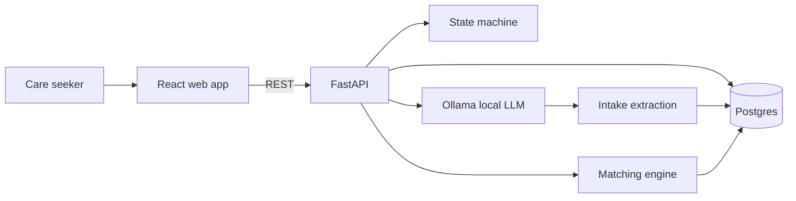

# Portfolio Overview — Florence

## Elevator pitch

**Florence** turns a confusing, emotional first contact about elder care into a structured intake, a care-type recommendation, ranked provider matches, and a clear next step — with **local-only AI** so sensitive family conversations never leave the machine.

Built for the **Arya Health hackathon** (Jul 2026).

## Problem

Families searching for elder care often:

- Don't know whether hospice, home care, assisted living, or skilled nursing fits
- Feel overwhelmed during an already stressful moment
- Repeat the same story to multiple providers without structure
- Need guidance without receiving a medical diagnosis

Traditional phone trees and generic chatbots fail because they are either rigid or unsafe — they don't combine **empathy**, **deterministic intake**, and **explainable matching**.

## Solution

Florence acts as a **care-navigation first point of contact**:

1. **Converses** by text or browser voice (Web Speech API)
2. **Collects** structured intake into Postgres as the conversation progresses
3. **Recommends** a primary care type (e.g. memory care vs home care) with plain-language rationale
4. **Matches** 1–3 synthetic providers using hard filters + weighted scoring
5. **Submits** a mock referral after user selection and consent validation

The LLM (Ollama) generates natural phrasing and helps extract fields, but the **application controls state transitions** — the model does not freestyle the workflow.

## Demo story

**Caller:** Adult daughter in Queens seeking care for her 82-year-old father.

**Situation:** Memory concerns, bathing/meal help, fall history (non-emergency), budget $6k–$8k/month, care needed within 30 days.

**Expected flow:**

1. Disclosure and consent
2. Structured intake questions across care needs, location, budget, timing
3. Care-type recommendation (e.g. memory care / assisted living)
4. Three ranked provider cards with strengths and uncertainties
5. User selects a provider → summary validation → mock referral recorded

See the full scripted scenario in [handoff.md §23](handoff.md#23-first-demo-scenario).

## Technical highlights

| Area | Approach |
|------|----------|
| **Privacy** | Ollama local-only; no hosted LLM APIs with user intake |
| **Determinism** | Explicit conversation state machine; required-field tracker |
| **Matching** | Two-stage: hard filters → weighted score (care fit weighted highest) |
| **Safety** | Emergency/abuse phrase detection halts normal matching |
| **Quality** | TDD (35 backend tests), pre-push hooks (tests + lint + gitleaks) |
| **Stack** | React + Vite, FastAPI, Postgres 16, SQLAlchemy 2, Ollama `llama3.2:3b` |

## Architecture at a glance

## What makes this portfolio-worthy

- **Humanistic product framing** — not a generic chatbot; built around real elder-care navigation stages
- **Security-first repo** — gitleaks, redaction-ready logging, public-repo discipline from day zero
- **Explainable matching** — every provider card includes strengths and concerns; referral economics separated from care-fit scoring
- **Web-first MVP** with a clear path to **M2 telephony** (Twilio + Pipecat) reusing the same conversation engine

## Constraints (intentional)

- **Not HIPAA-compliant** — hackathon MVP with synthetic provider data
- **Not medical advice** — navigation and qualification only
- **Mock referrals** — no live provider inventory or CRM integration
- **Local demo** — Postgres and Ollama expected on developer machine

## Links

- [Getting started](getting-started.md)
- [Architecture](architecture.md)
- [Full product spec](handoff.md)
- [GitHub repository](https://github.com/DouglasMacKrell/florence)
